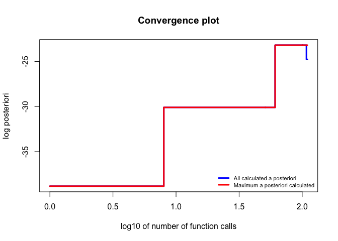
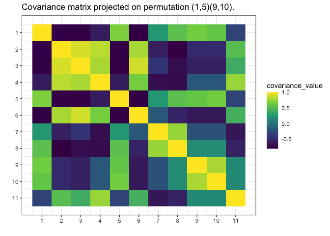

<!-- README.md is generated from README.Rmd. Please edit that file -->

# `gips`

<!-- badges: start -->

[](https://lifecycle.r-lib.org/articles/stages.html#experimental)
[](https://CRAN.R-project.org/package=gips)
[](https://github.com/PrzeChoj/gips/actions/workflows/R-CMD-check.yaml)
[](https://codecov.io/gh/PrzeChoj/gips?branch=main)
<!-- badges: end -->

gips - Gaussian model Invariant by Permutation Symmetry

`gips` is an R package that finds the permutation symmetry group such
that the covariance matrix of the given data is invariant under it.
Knowledge of such a permutation can drastically decrease the number of
parameters needed to fit the model. That means that with `gips`, it is
possible to find the Gaussian model with more parameters than the number
of observations. Sometimes, even if the number of observations is bigger
than the number of parameters, the covariance matrix found with `gips`
better approximates the actual covariance behind the data.

## `gips` will help you with two things:

1.  Exploratory Data Analysis - with `gips`, you can find the
    permutation of features that approximately does not change the
    covariance matrix.
2.  Modeling - with `gips`, you can accurately use the found permutation
    to fit the normal models like LDA or QDA.

## Installation

You can install the development version of gips from
[GitHub](https://github.com/PrzeChoj/gips) with:

``` r
# install.packages("devtools")
devtools::install_github("PrzeChoj/gips")
```

## Examples

### Example 1

Assume we have the data, and we want to understand the structure of it:

``` r
library(gips)

Z <- as.matrix(mtcars)

# Assume the data is normal. It is not very sensible assumprion looking at this distributions:
# hist(Z[,2])
# but let's do it for the purpose of the example

Z_scaled <- scale(Z)

S <- cov(Z_scaled)
g <- gips(S, nrow(Z_scaled), was_mean_estimated = TRUE)
plot(g, type = 'heatmap')
```


``` r
# We can see some strong relationships between columns in this matrix.
  # For example, 9 and 10 have very similar coralations to other variables.

g_MAP <- find_MAP(g, max_iter = 10, optimizer = "MH")
#> ========================================================================
plot(g_MAP, type = 'both', logarithmic_x = TRUE)
```


``` r
plot(g_MAP, type = 'heatmap')
```


``` r

g_MAP <- find_MAP(g_MAP, max_iter = 100, optimizer = "continue")
#> ===============================================================================
plot(g_MAP, type = 'both', logarithmic_x = TRUE)
```



``` r
plot(g_MAP, type = 'heatmap')
```



``` r
summary(g_MAP)
#> The optimized `gips` object.
#> 
#> Permutation:
#>  (5,9,10)
#> 
#> Log_posteriori:
#>  -23.19336
#> 
#> Number of observations:
#>  32
#> 
#> The mean in `S` was estimated.
#> Therefore, one degree of freedom was lost. There is 31 degrees of freedom left.
#> 
#> n0:
#>  9
#> 
#> Number of observations is bigger than n0 for this permutaion,
#> so the gips model based on the found permutation does exist.
#> 
#> --------------------------------------------------------------------------------
#> Optimization algorithms:
#>  Metropolis_Hastings, Metropolis_Hastings
#> 
#> Number of log_posteriori calls:
#>  110
#> 
#> Optimization time:
#>  0.6324432 secs
#> 
#> Acceptance rate:
#>  0.0272727272727273
#> 
#> Log_posteriori calls after the found permutation:
#>  3
```

### Example 2

Assume we know the mean is 0, and we want to estimate the covariance
matrix, but we don’t have enough data:

``` r
library(gips)

# Prepare model, multivariate normal distribution
perm_size <- 6
mu <- numeric(perm_size)  
sigma_matrix <- matrix(
  data = c(
    1.0, 0.8, 0.6, 0.4, 0.6, 0.8,
    0.8, 1.0, 0.8, 0.6, 0.4, 0.6,
    0.6, 0.8, 1.0, 0.8, 0.6, 0.4,
    0.4, 0.6, 0.8, 1.0, 0.8, 0.6,
    0.6, 0.4, 0.6, 0.8, 1.0, 0.8,
    0.8, 0.6, 0.4, 0.6, 0.8, 1.0
  ),
  nrow = perm_size, byrow = TRUE
) # sigma_matrix is a matrix invariant under permutation (1,2,3,4,5,6)
number_of_observations <- 4 # 4 < 6, so n < p

# generate example data from a model:
Z <- MASS::mvrnorm(number_of_observations, mu = mu, Sigma = sigma_matrix)

# calculate the covariance matrix from the data:
S <- (t(Z) %*% Z) / number_of_observations
# the theoretical mean is 0, so this S is the Maximum likelihood estimation of the covariance matrix

# Make the gips object out of data:
g <- gips(S, number_of_observations, was_mean_estimated = FALSE)

# Find the Maximum A Posteriori Estimator for the permutation:
g_map <- find_MAP(g, show_progress_bar = TRUE, optimizer = "full")
#> ================================================================================
g_map
#> The permutation (1,3,4,6)(2,5) has log posteriori -6.59017393217882 which was found after 720 log_posteriori calculations.

summary(g_map)$n0
#> [1] 2

# We see the number of observations is bigger than n0, so we can estimate the covariance matrix with Maximum Likelihood estimator:
project_matrix(S, g_map[[1]])
#>           [,1]      [,2]      [,3]      [,4]      [,5]      [,6]
#> [1,] 1.3579574 0.9653756 0.9653756 0.5727939 0.9653756 0.9653756
#> [2,] 0.9653756 1.0405983 0.9653756 0.9653756 0.8901530 0.9653756
#> [3,] 0.9653756 0.9653756 1.3579574 0.9653756 0.9653756 0.5727939
#> [4,] 0.5727939 0.9653756 0.9653756 1.3579574 0.9653756 0.9653756
#> [5,] 0.9653756 0.8901530 0.9653756 0.9653756 1.0405983 0.9653756
#> [6,] 0.9653756 0.9653756 0.5727939 0.9653756 0.9653756 1.3579574

# Plot the found matrix:
plot(g_map, type = "heatmap")
```


# Credits

It was developed in 2022 by Przemysław Chojecki and Paweł Morgen under
the leadership of Ph.D. Bartosz Kołodziejek within the “CyberiADa-3”
(2021) grant from the Warsaw University of Technology.
