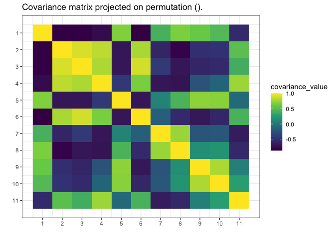
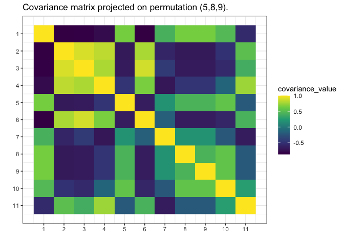
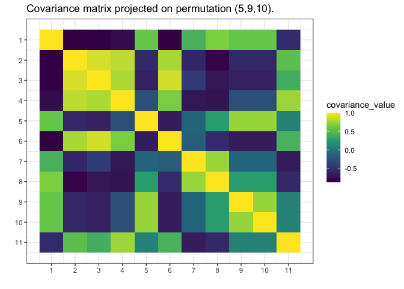
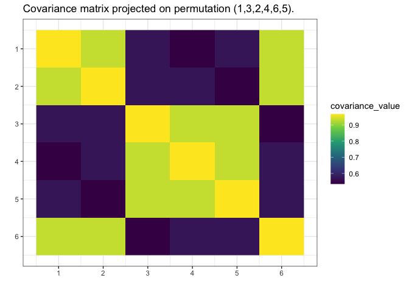

<!-- README.md is generated from README.Rmd. Please edit that file -->

# `gips`

<!-- badges: start -->

[](https://lifecycle.r-lib.org/articles/stages.html#experimental)
[](https://CRAN.R-project.org/package=gips)
[](https://github.com/PrzeChoj/gips/actions/workflows/R-CMD-check.yaml)
[](https://codecov.io/gh/PrzeChoj/gips?branch=main)
<!-- badges: end -->

gips - Gaussian model Invariant by Permutation Symmetry

`gips` is an R package that finds the permutation symmetry group such
that the covariance matrix of the given data is invariant under it.
Knowledge of such a permutation can drastically decrease the number of
parameters needed to fit the model. That means that with `gips`, it is
possible to find the Gaussian model with more parameters than the number
of observations. Sometimes, even if the number of observations is bigger
than the number of parameters, the covariance matrix found with `gips`
better approximates the actual covariance behind the data.

## `gips` will help you with two things:

1.  Exploratory Data Analysis (EDA) - with `gips`, you can find the
    permutation of features that approximately does not change the
    covariance matrix.
2.  Modeling - with `gips`, you can accurately use the found permutation
    to fit the normal models like LDA or QDA.

## Installation

You can install the development version of gips from
[GitHub](https://github.com/PrzeChoj/gips) with:

``` r
# install.packages("devtools")
devtools::install_github("PrzeChoj/gips")
```

## Examples

### Example 1 - EDA

Assume we have the data, and we want to understand its structure:

``` r
library(gips)

Z <- as.matrix(mtcars)

# Assume the data is normal.
  # Looking at this (`hist(Z[,2])`) distribution,
  # it is not a remarkably sensible assumption,
  # but let's do it for the example.

S <- cor(Z_scaled)
g <- gips(S, nrow(Z_scaled), was_mean_estimated = TRUE)
plot(g, type = 'heatmap')
```



``` r
# We can see some strong relationships between columns in this matrix.
  # For example, 9 and 10 have very similar correlations to other variables.

# Let's see if the find_MAP will find this relationship:
g_MAP <- find_MAP(g, max_iter = 10, optimizer = "MH")
#> ========================================================================
plot(g_MAP, type = 'heatmap')
```



``` r
# Even after a short time (only 10 iterations),
  # find_MAP found some relationship.

# Let's see what it will find with a slightly bigger budget:
g_MAP <- find_MAP(g_MAP, max_iter = 100, optimizer = "continue")
#> ===============================================================================
plot(g_MAP, type = 'heatmap')
```



``` r
# find_MAP found the (9,10) relationship and even something more.
```

### Example 2 - modeling

Assume we know the mean is 0, and we want to estimate the covariance
matrix, but we don’t have enough data:

``` r
# Prepare model, multivariate normal distribution
perm_size <- 6
mu <- numeric(perm_size)  
sigma_matrix <- matrix(
  data = c(
    1.0, 0.8, 0.6, 0.4, 0.6, 0.8,
    0.8, 1.0, 0.8, 0.6, 0.4, 0.6,
    0.6, 0.8, 1.0, 0.8, 0.6, 0.4,
    0.4, 0.6, 0.8, 1.0, 0.8, 0.6,
    0.6, 0.4, 0.6, 0.8, 1.0, 0.8,
    0.8, 0.6, 0.4, 0.6, 0.8, 1.0
  ),
  nrow = perm_size, byrow = TRUE
) # sigma_matrix is a matrix invariant under permutation (1,2,3,4,5,6)

# generate example data from a model:
Z <- MASS::mvrnorm(4, mu = mu, Sigma = sigma_matrix)
# End of prepare model


library(gips)
(number_of_observations <- nrow(Z)) # 4 < 6, so n < p
#> [1] 4

# calculate the covariance matrix from the data:
S <- (t(Z) %*% Z) / number_of_observations

# Make the gips object out of data:
g <- gips(S, number_of_observations, was_mean_estimated = FALSE)

# Find the Maximum A Posteriori Estimator for the permutation.
  # Space is small (6! = 720), so it is reasonable to
  # browse the whole of it:
g_map <- find_MAP(g, show_progress_bar = TRUE, optimizer = "full")
#> ================================================================================
g_map
#> The permutation (1,2,6,4,5,3) has log posteriori -5.63840470919283 which was found after 720 log_posteriori calculations.

summary(g_map)$n0
#> [1] 1
summary(g_map)$n0 <= 4
#> [1] TRUE

# We see the number of observations (4) is bigger or equal to n0,
  # so we can estimate the covariance matrix
  # with the Maximum Likelihood estimator:
project_matrix(S, g_map[[1]])
#>          [,1]     [,2]     [,3]     [,4]     [,5]     [,6]
#> [1,] 1.626103 1.264264 1.264264 1.199515 1.561354 1.561354
#> [2,] 1.264264 1.626103 1.561354 1.561354 1.199515 1.264264
#> [3,] 1.264264 1.561354 1.626103 1.561354 1.264264 1.199515
#> [4,] 1.199515 1.561354 1.561354 1.626103 1.264264 1.264264
#> [5,] 1.561354 1.199515 1.264264 1.264264 1.626103 1.561354
#> [6,] 1.561354 1.264264 1.199515 1.264264 1.561354 1.626103

# Plot the found matrix:
plot(g_map, type = "heatmap")
```



# Credits

`gips` was developed in 2022 by Przemysław Chojecki and Paweł Morgen
under the leadership of Ph.D. Bartosz Kołodziejek within the
“CyberiADa-3” (2021) grant from the Warsaw University of Technology.
