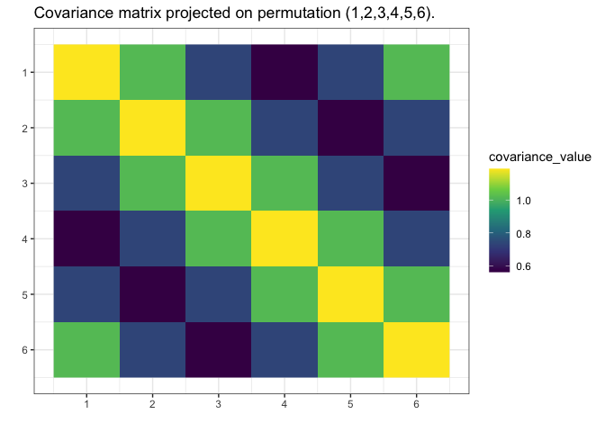

<!-- README.md is generated from README.Rmd. Please edit that file -->

# `gips`

<!-- badges: start -->

[](https://lifecycle.r-lib.org/articles/stages.html#experimental)
[](https://CRAN.R-project.org/package=gips)
[](https://github.com/PrzeChoj/gips/actions/workflows/R-CMD-check.yaml)
[](https://codecov.io/gh/PrzeChoj/gips?branch=main)
<!-- badges: end -->

gips - Gaussian model Invariant by Permutation Symmetry

`gips` is an R package that finds the permutation symmetry group such
that the covariance matrix of the given data is invariant under it.
Knowledge of such a permutation can drastically decrease the number of
parameters needed to fit the model. That means that with `gips`, it is
possible to find the Gaussian model with more parameters than the number
of observations. Sometimes, even if the number of observations is bigger
than the number of parameters, the covariance matrix found with `gips`
better approximates the actual covariance behind the data.

## `gips` will help you with two things:

1.  Exploratory Data Analysis - with `gips`, you can find the
    permutation of features that approximately does not change the
    covariance matrix.
2.  Modeling - with `gips`, you can accurately use the found permutation
    to fit the normal models like LDA or QDA.

## Installation

You can install the development version of gips from
[GitHub](https://github.com/PrzeChoj/gips) with:

``` r
# install.packages("devtools")
devtools::install_github("PrzeChoj/gips")
```

## Example

TODO(Example without assuming known mean)

Assume we know the mean is
,
and we want to estimate the covariance matrix:

``` r
library(gips)

# Prepare model, multivariate normal distribution
perm_size <- 6
mu <- numeric(perm_size)  
sigma_matrix <- matrix(
  data = c(
    1.0, 0.8, 0.6, 0.4, 0.6, 0.8,
    0.8, 1.0, 0.8, 0.6, 0.4, 0.6,
    0.6, 0.8, 1.0, 0.8, 0.6, 0.4,
    0.4, 0.6, 0.8, 1.0, 0.8, 0.6,
    0.6, 0.4, 0.6, 0.8, 1.0, 0.8,
    0.8, 0.6, 0.4, 0.6, 0.8, 1.0
  ),
  nrow = perm_size, byrow = TRUE
) # sigma_matrix is a matrix invariant under permutation (1,2,3,4,5,6)
number_of_observations <- 13

# generate example data from a model:
Z <- MASS::mvrnorm(number_of_observations, mu = mu, Sigma = sigma_matrix)

# calculate the covariance matrix from the data:
S <- (t(Z) %*% Z) / number_of_observations
# the theoretical mean is 0, so this S is the Maximum likelihood estimation of the covariance matrix

# Make the gips object out of data:
g <- gips(S, number_of_observations)

# Find the Maximum A Posteriori Estimator for the permutation:
g_map <- find_MAP(g, show_progress_bar = TRUE, optimizer = "full")
#> ================================================================================
g_map
#> The permutation (1,2,3,4,5,6) has log posteriori -0.15575126668579 which was found after 720 log_posteriori calculations.

summary(g_map)
#> The optimized `gips` object.
#> 
#> Permutation:
#>  (1,2,3,4,5,6)
#> 
#> Log_posteriori:
#>  -0.1557513
#> 
#> Number of observations:
#>  13
#> 
#> n0:
#>  1
#> 
#> Number of observations is bigger than n0 for this permutaion, so the gips model based on the found permutation does exist.
#> 
#> --------------------------------------------------------------------------------
#> Optimization algorithm:
#>  brute_force
#> 
#> Number of log_posteriori calls:
#>  720
#> 
#> Optimization time:
#>  1.957744 secs

# find_MAP() found the permutation; now, make a matrix estimator:
project_matrix(S, g_map[[1]])
#>           [,1]      [,2]      [,3]      [,4]      [,5]      [,6]
#> [1,] 1.1894104 1.0174834 0.7342702 0.5623432 0.7342702 1.0174834
#> [2,] 1.0174834 1.1894104 1.0174834 0.7342702 0.5623432 0.7342702
#> [3,] 0.7342702 1.0174834 1.1894104 1.0174834 0.7342702 0.5623432
#> [4,] 0.5623432 0.7342702 1.0174834 1.1894104 1.0174834 0.7342702
#> [5,] 0.7342702 0.5623432 0.7342702 1.0174834 1.1894104 1.0174834
#> [6,] 1.0174834 0.7342702 0.5623432 0.7342702 1.0174834 1.1894104

# Plot the found matrix:
plot(g_map, type = "heatmap")
```



# Credits

It was developed in 2022 by Przemysław Chojecki and Paweł Morgen under
the leadership of Ph.D. Bartosz Kołodziejek within the “CyberiADa-3”
(2021) grant from the Warsaw University of Technology.
