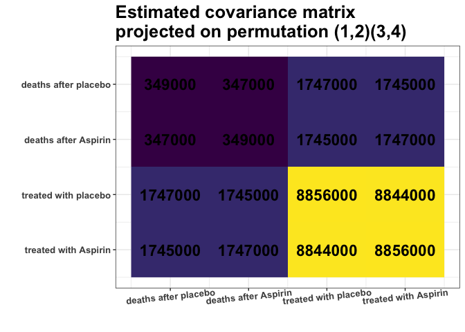
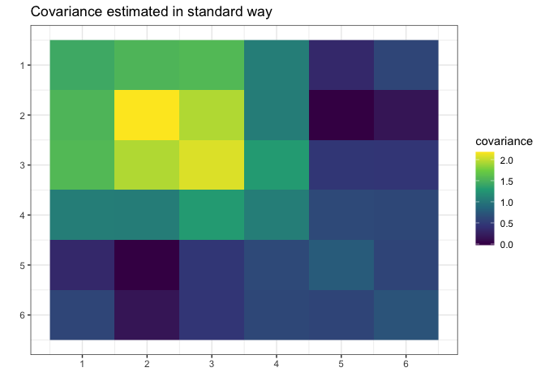

<!-- README.md is generated from README.Rmd. Please edit that file -->

# `gips` <a href="https://przechoj.github.io/gips/"></a>

<!-- badges: start -->

[](https://lifecycle.r-lib.org/articles/stages.html#stable)
[](https://CRAN.R-project.org/package=gips)
[](https://github.com/PrzeChoj/gips/actions/workflows/R-CMD-check.yaml)
[](https://app.codecov.io/gh/PrzeChoj/gips?branch=main)


<!-- badges: end -->

gips - Gaussian model Invariant by Permutation Symmetry

`gips` is an R package that looks for permutation symmetries in the
multivariate Gaussian sample. Such symmetries reduce the free parameters
in the unknown covariance matrix. This is especially useful when the
number of variables is substantially larger than the number of
observations.

## `gips` will help you with two things:

1.  Finding hidden symmetries between the variables. `gips` can be used
    as an exploratory tool for searching the space of permutation
    symmetries of the Gaussian vector. Useful in the Exploratory Data
    Analysis (EDA).
2.  Covariance estimation. The Maximum Likelihood Estimator (MLE) for
    the covariance matrix is known to exist if and only if the number of
    variables is less or equal to the number of observations. Additional
    knowledge of symmetries significantly weakens this requirement.
    Moreover, the reduction of model dimension brings the advantage in
    terms of precision of covariance estimation.

## Installation

From [CRAN](https://CRAN.R-project.org/package=gips):

``` r
# Install the released version from CRAN:
install.packages("gips")
```

From [GitHub](https://github.com/PrzeChoj/gips):

``` r
# Install the development version from GitHub:
# install.packages("remotes")
remotes::install_github("PrzeChoj/gips")
```

## Examples

### Example 1 - EDA

Assume we have the data, and we want to understand its structure:

``` r
library(gips)

Z <- HSAUR2::aspirin

# Renumber the columns for better readability:
Z[, c(2, 3)] <- Z[, c(3, 2)]
```

Assume the data `Z` is normally distributed.

``` r
dim(Z)
#> [1] 7 4
number_of_observations <- nrow(Z) # 7
p <- ncol(Z) # 4

S <- cov(Z)
round(S, -3)
#>         [,1]    [,2]    [,3]    [,4]
#> [1,]  381000  347000 1834000 1814000
#> [2,]  347000  317000 1675000 1659000
#> [3,] 1834000 1675000 8958000 8844000
#> [4,] 1814000 1659000 8844000 8755000

g <- gips(S, number_of_observations)
plot_cosmetic_modifications(plot(g, type = "heatmap"))
```


Remember, we analyze the covariance matrix. We can see some nearly
identical colors in the estimated covariance matrix. E.g., variances of
columns 1 and 2 are very similar (`S[1,1]` $\approx$ `S[2,2]`), and
variances of columns 3 and 4 are very similar (`S[3,3]` $\approx$
`S[4,4]`). What is more, Covariances are also similar (`S[1,3]`
$\approx$ `S[1,4]` $\approx$ `S[2,3]` $\approx$ `S[2,4]`). Are those
approximate equalities coincidental? Or do they reflect some underlying
data properties? It is hard to decide purely by looking at the matrix.

`find_MAP()` will use the Bayesian model to quantify if the approximate
equalities are coincidental. Let’s see if it will find this
relationship:

``` r
g_MAP <- find_MAP(g, optimizer = "brute_force")
#> ================================================================================

g_MAP
#> The permutation (1,2)(3,4):
#>  - was found after 17 posteriori calculations;
#>  - is 3.374 times more likely than the () permutation.
```

The `find_MAP` found the relationship (1,2)(3,4). The variances \[1,1\]
and \[2,2\] as well as \[3,3\] and \[4,4\] are so close to each other
that it is reasonable to consider them equal. Similarly, the covariances
\[1,3\] and \[2,4\]; just as covariances \[2,3\] and \[1,4\], also will
be considered equal:

``` r
S_projected <- project_matrix(S, g_MAP)
round(S_projected)
#>         [,1]    [,2]    [,3]    [,4]
#> [1,]  349160  347320 1746602 1744545
#> [2,]  347320  349160 1744545 1746602
#> [3,] 1746602 1744545 8856368 8844312
#> [4,] 1744545 1746602 8844312 8856368

plot_cosmetic_modifications(plot(g_MAP, type = "heatmap"))
```



This `S_projected` matrix can now be interpreted as a more stable
covariance matrix estimator.

We can also interpret the output as suggesting that there is no change
in covariance for treatment with Aspirin.

### Example 2 - modeling

First, construct data for the example:

``` r
# Prepare model, multivariate normal distribution
p <- 6
n <- 4
mu <- numeric(p)
sigma_matrix <- matrix(
  data = c(
    1.1, 0.8, 0.6, 0.4, 0.6, 0.8,
    0.8, 1.1, 0.8, 0.6, 0.4, 0.6,
    0.6, 0.8, 1.1, 0.8, 0.6, 0.4,
    0.4, 0.6, 0.8, 1.1, 0.8, 0.6,
    0.6, 0.4, 0.6, 0.8, 1.1, 0.8,
    0.8, 0.6, 0.4, 0.6, 0.8, 1.1
  ),
  nrow = p, byrow = TRUE
) # sigma_matrix is a matrix invariant under permutation (1,2,3,4,5,6)


# Generate example data from a model:
Z <- withr::with_seed(2022,
  code = MASS::mvrnorm(n, mu = mu, Sigma = sigma_matrix)
)
# End of prepare model
```


Suppose we do not know the actual covariance matrix $\Sigma$ and we want
to estimate it. We cannot use the standard MLE because it does not
exists ($4 < 6$, $n < p$).

We will assume it was generated from the normal distribution with the
mean $0$.

``` r
library(gips)
dim(Z)
#> [1] 4 6
number_of_observations <- nrow(Z) # 4
p <- ncol(Z) # 6

# Calculate the covariance matrix from the data:
S <- (t(Z) %*% Z) / number_of_observations
```

Make the gips object out of data:

``` r
g <- gips(S, number_of_observations, was_mean_estimated = FALSE)
```

We can see the standard estimator of the covariance matrix:
$$\hat{\Sigma} = (1/n) \cdot  \Sigma_{i=1}^n \Big( Z^{(i)}\cdot\big({Z^{(i)}}^\top\big) \Big)$$
It is not MLE (again, because MLE does not exist for $n < p$):

``` r
plot(g, type = "heatmap") + ggplot2::ggtitle("Covariance estimated in standard way")
```



Let’s find the Maximum A Posteriori Estimator for the permutation. Space
is small ($6! = 720$), so it is reasonable to browse the whole of it:

``` r
g_map <- find_MAP(g, optimizer = "brute_force")
#> ================================================================================

g_map
#> The permutation (1,2,3,4,5,6):
#>  - was found after 362 posteriori calculations;
#>  - is 118.863 times more likely than the () permutation.
```

We see that the found permutation is over a hundred times more likely
than making no additional assumption. That means the additional
assumptions are justified.

``` r
summary(g_map)$n0
#> [1] 1
summary(g_map)$n0 <= number_of_observations # 1 <= 4
#> [1] TRUE
```

What is more, we see the number of observations ($4$) is bigger or equal
to $n_0 = 1$, so we can estimate the covariance matrix with the Maximum
Likelihood estimator:

``` r
S_projected <- project_matrix(S, g_map)
S_projected
#>           [,1]      [,2]      [,3]      [,4]      [,5]      [,6]
#> [1,] 1.3747718 1.0985729 0.6960213 0.4960295 0.6960213 1.0985729
#> [2,] 1.0985729 1.3747718 1.0985729 0.6960213 0.4960295 0.6960213
#> [3,] 0.6960213 1.0985729 1.3747718 1.0985729 0.6960213 0.4960295
#> [4,] 0.4960295 0.6960213 1.0985729 1.3747718 1.0985729 0.6960213
#> [5,] 0.6960213 0.4960295 0.6960213 1.0985729 1.3747718 1.0985729
#> [6,] 1.0985729 0.6960213 0.4960295 0.6960213 1.0985729 1.3747718

# Plot the found matrix:
plot(g_map, type = "heatmap") + ggplot2::ggtitle("Covariance estimated with `gips`")
```


We see `gips` found the data’s structure, and we could estimate the
covariance matrix with huge accuracy only with a small amount of data
and additional reasonable assumptions.

Note that the rank of the `S` matrix was 4, while the rank of the
`S_projected` matrix was 6 (full rank).

# Further reading

For more examples and introduction, see
`vignette("gips", package="gips")` or its [pkgdown
page](https://przechoj.github.io/gips/articles/gips.html).

For an in-depth analysis of the package performance, capabilities, and
comparison with similar packages, see the article “Learning permutation
symmetries with gips in R” by `gips` developers Adam Chojecki, Paweł
Morgen, and Bartosz Kołodziejek, [Journal of Statistical
Software](https://doi.org/10.18637/jss.v112.i07).

# Acknowledgment

Project was funded by Warsaw University of Technology within the
Excellence Initiative: Research University (IDUB) programme.

The development was carried out with the support of the Laboratory of
Bioinformatics and Computational Genomics and the High Performance
Computing Center of the Faculty of Mathematics and Information Science
Warsaw University of Technology.
