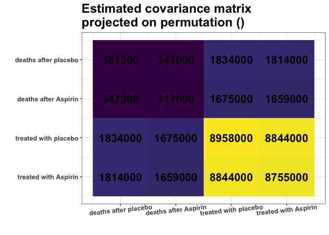
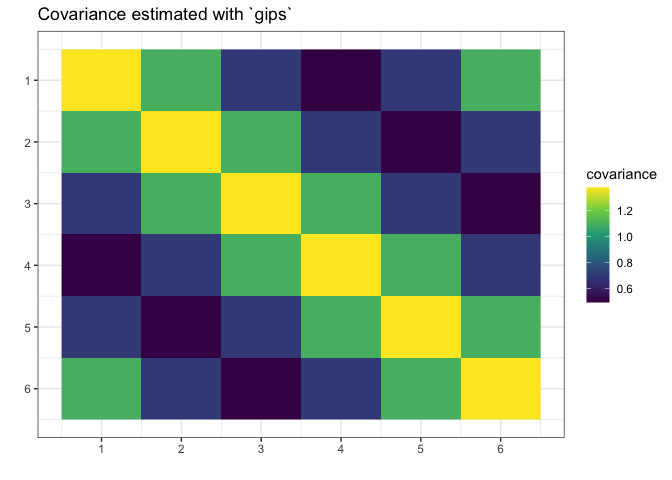

<!-- README.md is generated from README.Rmd. Please edit that file -->

# `gips`

<!-- badges: start -->

[](https://lifecycle.r-lib.org/articles/stages.html#experimental)
[](https://CRAN.R-project.org/package=gips)
[](https://github.com/PrzeChoj/gips/actions/workflows/R-CMD-check.yaml)
[](https://codecov.io/gh/PrzeChoj/gips?branch=main)
<!-- badges: end -->

gips - Gaussian model Invariant by Permutation Symmetry

TODO(Choose one:)

**Kolodziejek’s introduction**:

`gips` is an R package that performs the Bayesian model selection
procedure within Gaussian models invariant by permutation symmetry
described by a cyclic subgroup. Permutation invariance of the Gaussian
distribution results in certain symmetries of its covariance matrix.
Such symmetry conditions reduce the number of parameters to estimate.
This is especially useful when parsimony is needed, i.e. when the number
of variables is substantially larger than the number of observations.
Given the Gaussian multivariate sample and two hyperparameters, through
a brute-force search or the Metropolis-Hasting algorithm, `gips` will
try to find a cyclic subgroup that best fits the data and will return
the estimated posterior probabilities for all cyclic subgroups.

**Adam’s introduction**:

`gips` is an R package that finds the permutation symmetry group such
that the covariance matrix of the given data is invariant under it.
Knowledge of such a permutation can drastically decrease the number of
parameters needed to fit the model. That means that with `gips`, it is
possible to find the Gaussian model with more parameters than the number
of observations. In case when the number of observations is bigger than
the number of parameters, the covariance matrix found with `gips` better
approximates the actual covariance behind the data.

**Mixed introduction**:

`gips` is an R package that finds the believable permutation symmetry of
the covariance matrix. Such a symmetry condition reduces the number of
parameters to estimate. This is especially useful when the number of
variables is substantially larger than the number of observations.

## `gips` will help you with two things:

1.  Finding hidden symmetries between the variables. `gips` can be used
    as an exploratory tool searching the space of permutation symmetries
    of the Gaussian vector. Useful in the Exploratory Data Analysis
    (EDA).
2.  Covariance estimation. The MLE for the covariance matrix is known to
    exist if and only if the number of variables is less or equal to the
    number of observations. Additional knowledge of symmetries (which
    `gips` can find) significantly weakens this requirement. Moreover,
    the reduction of model dimension brings the advantage in terms of
    precision of covariance estimation. This is useful in models like
    Linear Discriminant Analysis (LDA) or Quadratic Discriminant
    Analysis (QDA). Especially with a small number of observations.

## Installation

From [GitHub](https://github.com/PrzeChoj/gips):

``` r
# Install the development version from GitHub:
# install.packages("devtools")
devtools::install_github("PrzeChoj/gips")
```

From [CRAN](https://CRAN.R-project.org/package=gips) (it is yet to be
published):

``` r
# Install the released version from CRAN:
install.packages("gips")
```

## Examples

### Example 1 - EDA

Assume we have the data, and we want to understand its structure:

``` r
library(gips)

Z <- DAAG::oddbooks
```

Assume the data is normally distributed. This is a reasonable
assumption, because, for example, p-values for Mardia’s normality tests:
`QuantPsyc::mult.norm(Z)$mult.test` are 0.53 and 0.22, which are \>
0.05.

``` r
Z_scaled <- scale(Z)
dim(Z_scaled)
#> [1] 12  4
number_of_observations <- nrow(Z) # 12
perm_size <- ncol(Z) # 4

S <- cov(Z_scaled)
S
#>              thick     height    breadth     weight
#> thick    1.0000000 -0.9392100 -0.8980836 -0.7897682
#> height  -0.9392100  1.0000000  0.9859209  0.9080642
#> breadth -0.8980836  0.9859209  1.0000000  0.9430565
#> weight  -0.7897682  0.9080642  0.9430565  1.0000000

g <- gips(S, number_of_observations)
plot(g, type = "heatmap")
```



We can see some strong similarities between columns 2 and 3,
representing the book’s height and breadth. In this matrix. For example,
covariance between \[1,2\] is very similar to \[1,3\]. And covariance
between \[2,4\] is very similar to \[3,4\]. Other covariance does not
seem so close to each other.

Let’s see if the `find_MAP()` will find this relationship:

``` r
g_MAP <- find_MAP(g, optimizer = "full")
#> ================================================================================

g_MAP
#> The permutation (2,3)
#>  - was found after 24 log_posteriori calculations
#>  - is 1.36889598145418 times more likely than the starting, () permutation.
```

`find_MAP` found the relationship (2,3). In its opinion, the covariance
\[1,2\] and \[1,3\] are so close to each other that it is reasonable to
consider them equal. Similarly, covariance \[2,4\] and \[3,4\] will be
considered equal:

``` r
S_projected <- project_matrix(S, g_MAP[[1]])
S_projected
#>            [,1]       [,2]       [,3]       [,4]
#> [1,]  1.0000000 -0.9186468 -0.9186468 -0.7897682
#> [2,] -0.9186468  1.0000000  0.9859209  0.9255604
#> [3,] -0.9186468  0.9859209  1.0000000  0.9255604
#> [4,] -0.7897682  0.9255604  0.9255604  1.0000000

plot(g_MAP, type = "heatmap")
```


Remember that `gips` performed those calculations on the `scale`d
version of the dataset, so practically, it was performed on the
correlation matrix and not the covariance matrix. The analysis is the
same, but one has to remember to come back to the original scaling:

``` r
sqrt_diag <- diag(sqrt(diag(cov(Z))))
estimated_covariance <- sqrt_diag %*% project_matrix(S, g_MAP[[1]]) %*% sqrt_diag
```

### Example 2 - modeling

First, construct data for the example:

``` r
# Prepare model, multivariate normal distribution
perm_size <- 6
mu <- numeric(perm_size)  
sigma_matrix <- matrix(
  data = c(
    1.1, 0.8, 0.6, 0.4, 0.6, 0.8,
    0.8, 1.1, 0.8, 0.6, 0.4, 0.6,
    0.6, 0.8, 1.1, 0.8, 0.6, 0.4,
    0.4, 0.6, 0.8, 1.1, 0.8, 0.6,
    0.6, 0.4, 0.6, 0.8, 1.1, 0.8,
    0.8, 0.6, 0.4, 0.6, 0.8, 1.1
  ),
  nrow = perm_size, byrow = TRUE
) # sigma_matrix is a matrix invariant under permutation (1,2,3,4,5,6)


# Generate example data from a model:
Z <- MASS::mvrnorm(4, mu = mu, Sigma = sigma_matrix)
# End of prepare model
```

Imagine we have the data `Z` but don’t know how it was generated. We
assume it was generated from the normal distribution with the mean
.
However, we cannot estimate the covariance matrix because there is
insufficient data
(,
).

``` r
library(gips)
dim(Z)
#> [1] 4 6
number_of_observations <- nrow(Z) # 4
perm_size <- ncol(Z) # 6

# Calculate the covariance matrix from the data:
S <- (t(Z) %*% Z) / number_of_observations
```

Make the gips object out of data:

``` r
g <- gips(S, number_of_observations, was_mean_estimated = FALSE)
```

Find the Maximum A Posteriori Estimator for the permutation. Space is
small
(),
so it is reasonable to browse the whole of it:

``` r
g_map <- find_MAP(g, optimizer = "full")
#> ================================================================================
g_map
#> The permutation (1,2,3,4,5,6)
#>  - was found after 720 log_posteriori calculations
#>  - is 234.659014400441 times more likely than the starting, () permutation.
```

We see that the found permutation is hundreds of times more likely than
making no additional assumption. That means the additional assumptions
are justified.

``` r
summary(g_map)$n0
#> [1] 1
summary(g_map)$n0 <= number_of_observations # 1 <= 4
#> [1] TRUE
```

What is more, we see the number of observations
()
is bigger or equal to
,
so we can estimate the covariance matrix with the Maximum Likelihood
estimator:

``` r
S_projected <- project_matrix(S, g_map[[1]])
S_projected
#>           [,1]      [,2]      [,3]      [,4]      [,5]      [,6]
#> [1,] 1.0432544 0.8066746 0.5881748 0.4007521 0.5881748 0.8066746
#> [2,] 0.8066746 1.0432544 0.8066746 0.5881748 0.4007521 0.5881748
#> [3,] 0.5881748 0.8066746 1.0432544 0.8066746 0.5881748 0.4007521
#> [4,] 0.4007521 0.5881748 0.8066746 1.0432544 0.8066746 0.5881748
#> [5,] 0.5881748 0.4007521 0.5881748 0.8066746 1.0432544 0.8066746
#> [6,] 0.8066746 0.5881748 0.4007521 0.5881748 0.8066746 1.0432544

# Plot the found matrix:
plot(g_map, type = "heatmap")
```



We see `gips` found the data’s structure, and we could estimate the
covariance matrix with huge accuracy only with a small amount of data.

Note that the rank of the `S` matrix was 4, while the rank of the
`S_projected` matrix was 6.

# Further reading

For more examples and introduction, see `vignette("gips")` or its
[pkgdown page](https://przechoj.github.io/gips/articles/gips.html).

# Credits

`gips` was developed in 2022 by Przemysław Chojecki and Paweł Morgen
under the leadership of Ph.D. Bartosz Kołodziejek under the
“CyberiADa-3” (2021) grant from the Warsaw University of Technology.
