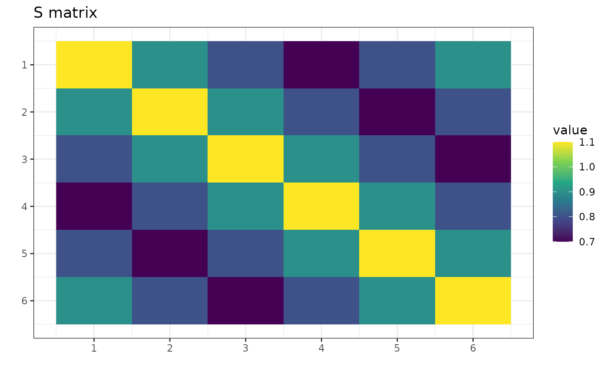
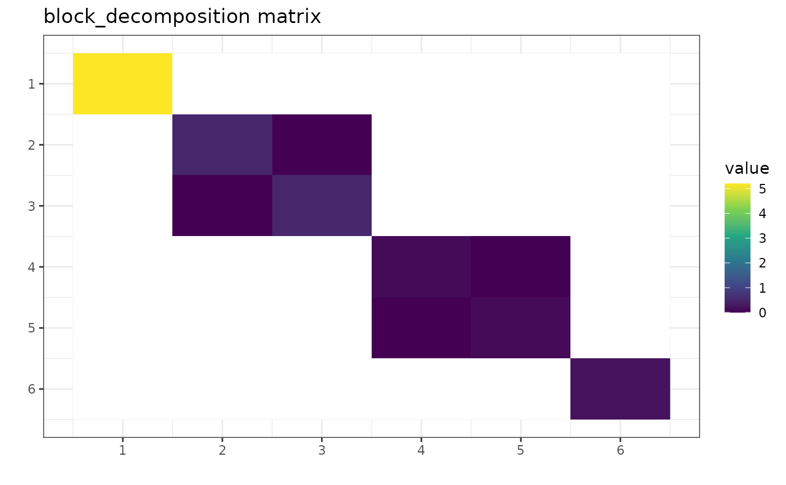
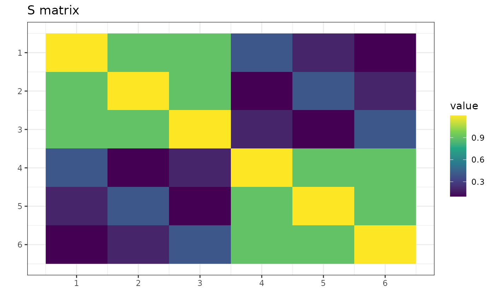
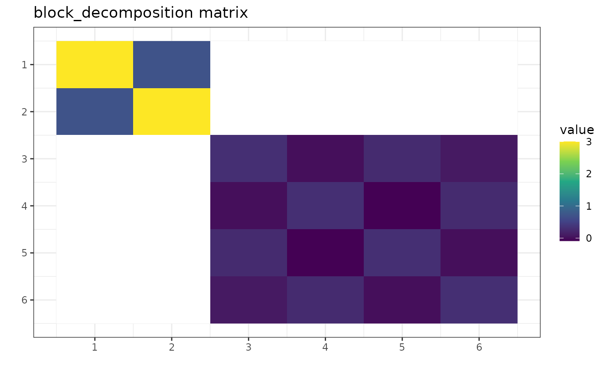
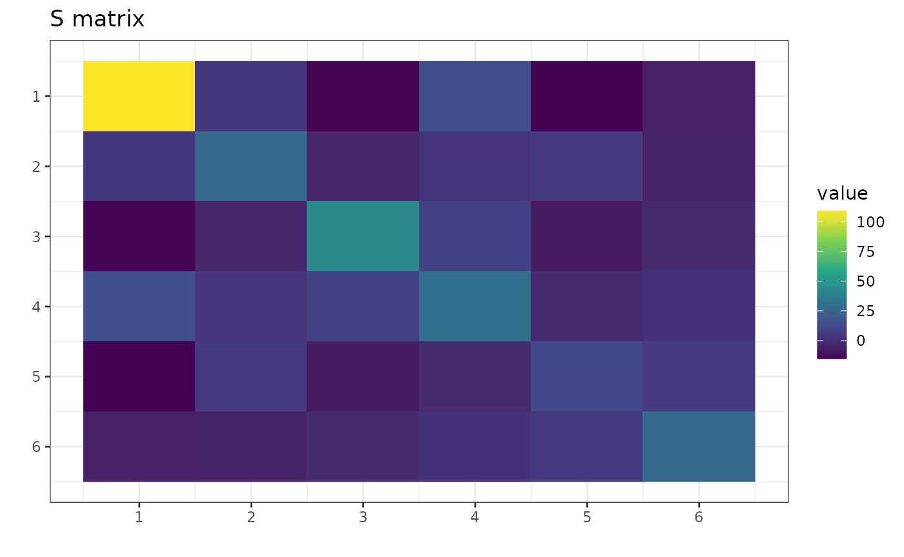
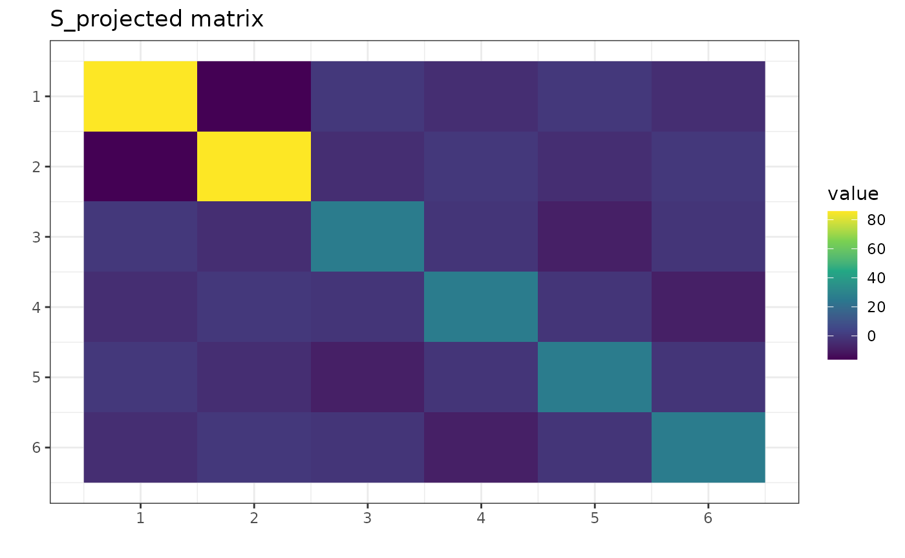
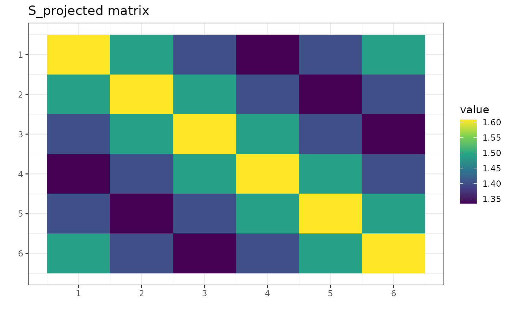

# The Theory Behind gips

## What the `gips` is based on

The package is based on the article
[\[1\]](https://arxiv.org/abs/2004.03503). There the math behind the
package is precisely demonstrated, and all the theorems are proven.

In this vignette, we would like to give a gentle introduction. We want
to point out all the most important results from this work from the
user’s point of view. We will also show examples of those results in the
`gips` package.

``` r

library(gips)
```

As mentioned in the abstract, the outline of the paper is to “derive the
distribution of the maximum likelihood estimate of the covariance
parameter $`\Sigma`$ (…)” and then to “perform Bayesian model selection
in the class of complete Gaussian models invariant by the action of a
subgroup of the symmetric group (…)”. Those ideas are implemented in the
`gips` package.

### Alternative reference

The theory derived in \[1\] is for general group invariance, while in
this package, we only consider invariance under cyclic groups. This
allows for massive simplifications. This simplified version is
comprehensibly set out in \[2\].

## Basic definitions

Let $`V=\{1,\ldots,p\}`$ be a finite index set, and for every
$`i\in \{1, \dots, n\}`$, $`Z^{(i)}=(Z_1^{(i)},\ldots, Z_p^{(i)})^\top`$
be a multivariate random variable following a centered Gaussian model
$`\mathrm{N}_p(0,\Sigma)`$, and let $`Z^{(1)},\ldots, Z^{(n)}`$ be an
i.i.d. (independent and identically distributed) sample from this
distribution. Name the whole sample $`Z = (Z^{(1)},\ldots, Z^{(n)})`$.

Let $`\mathfrak{S}_p`$ denote the symmetric group on $`V`$, that is, the
set of all permutations on $`\{1,\ldots,p\}`$ with function composition
as the group operation. Let $`\Gamma`$ be an arbitrary subgroup of
$`\mathfrak{S}_p`$. The model $`\mathrm{N}_p(0,\Sigma)`$ is said to be
invariant under the action of $`\Gamma`$ if for all $`g\in \Gamma`$,
$`g\cdot\Sigma\cdot g^\top=\Sigma`$ (here, we identify a permutation
$`g`$ with its permutation matrix).

For a subgroup $`\Gamma \subset  \mathfrak{S}_p`$, we define the colored
space, i.e., the space of symmetric matrices invariant under $`\Gamma`$,
``` math
\mathcal{Z}_{\Gamma} := \{S \in \mathrm{Sym}(p;\mathbb{R})\colon S_{i,j} = S_{\sigma(i),\sigma(j)} \text{ for all }\sigma \in \Gamma\mbox{ for all }i,j\in V\},
```
and the colored cone of positive definite matrices valued in
$`\mathcal{Z}_{\Gamma}`$,
``` math
\mathcal{P}_{\Gamma} := \mathcal{Z}_{\Gamma} \cap \mathrm{Sym}^+(p;\mathbb{R}).
```

## Block Decomposition - \[1\], Theorem 1

The main theoretical result in this theory (Theorem 1 in
[\[1\]](https://arxiv.org/abs/2004.03503)) states that given a
permutation subgroup $`\Gamma`$ there exists an orthogonal matrix
$`U_\Gamma`$ such that all the symmetric matrices
$`S\in\mathcal{Z}_\Gamma`$ can be transformed into block-diagonal form.

The exact form of blocks depends on so-called *structure constants*
$`(k_i,d_i,r_i)_{i=1}^L`$. It is worth pointing out that constants
$`k = d`$ for cyclic group $`\Gamma = \left<\sigma\right>`$ and that
`gips` searches within cyclic subgroups only.

#### Examples

``` r

p <- 6
S <- matrix(c(
  1.1, 0.9, 0.8, 0.7, 0.8, 0.9,
  0.9, 1.1, 0.9, 0.8, 0.7, 0.8,
  0.8, 0.9, 1.1, 0.9, 0.8, 0.7,
  0.7, 0.8, 0.9, 1.1, 0.9, 0.8,
  0.8, 0.7, 0.8, 0.9, 1.1, 0.9,
  0.9, 0.8, 0.7, 0.8, 0.9, 1.1
), nrow = p)
```



`S` is a symmetric matrix invariant under the group
$`\Gamma = \left<(1,2,3,4,5,6)\right>`$.

``` r

g_perm <- gips_perm("(1,2,3,4,5,6)", p)
U_Gamma <- prepare_orthogonal_matrix(g_perm)

block_decomposition <- t(U_Gamma) %*% S %*% U_Gamma
round(block_decomposition, 5)
#>      [,1] [,2] [,3] [,4] [,5] [,6]
#> [1,]  5.2  0.0  0.0  0.0  0.0  0.0
#> [2,]  0.0  0.5  0.0  0.0  0.0  0.0
#> [3,]  0.0  0.0  0.5  0.0  0.0  0.0
#> [4,]  0.0  0.0  0.0  0.1  0.0  0.0
#> [5,]  0.0  0.0  0.0  0.0  0.1  0.0
#> [6,]  0.0  0.0  0.0  0.0  0.0  0.2
```



The transformed matrix is in the block-diagonal form of
[\[1\]](https://arxiv.org/abs/2004.03503), Theorem 1. Blank entries are
off-block entries and equal to 0. Notice that, for example, the \[2,3\]
is not blank regardless of being 0. This is because it is a part of the
block-diagonal form but happens to have a value of 0.

The result was rounded to the 5th place after the decimal to hide the
inaccuracies of floating point arithmetic.

Let’s see the other example:

``` r

p <- 6
S <- matrix(c(
  1.2, 0.9, 0.9, 0.4, 0.2, 0.1,
  0.9, 1.2, 0.9, 0.1, 0.4, 0.2,
  0.9, 0.9, 1.2, 0.2, 0.1, 0.4,
  0.4, 0.1, 0.2, 1.2, 0.9, 0.9,
  0.2, 0.4, 0.1, 0.9, 1.2, 0.9,
  0.1, 0.2, 0.4, 0.9, 0.9, 1.2
), nrow = p)
```



Now, `S` is a symmetric matrix invariant under the group
$`\Gamma = \left<(1,2,3)(4,5,6)\right>`$.

``` r

g_perm <- gips_perm("(1,2,3)(4,5,6)", p)
U_Gamma <- prepare_orthogonal_matrix(g_perm)

block_decomposition <- t(U_Gamma) %*% S %*% U_Gamma
round(block_decomposition, 5)
#>      [,1] [,2]   [,3]    [,4]    [,5]   [,6]
#> [1,]  3.0  0.7 0.0000  0.0000  0.0000 0.0000
#> [2,]  0.7  3.0 0.0000  0.0000  0.0000 0.0000
#> [3,]  0.0  0.0 0.3000  0.0000  0.2500 0.0866
#> [4,]  0.0  0.0 0.0000  0.3000 -0.0866 0.2500
#> [5,]  0.0  0.0 0.2500 -0.0866  0.3000 0.0000
#> [6,]  0.0  0.0 0.0866  0.2500  0.0000 0.3000
```



Again, this result is in accordance with
[\[1\]](https://arxiv.org/abs/2004.03503), Theorem 1. Notice the zeros
in `block_decomposition`:
``` math
\forall_{i\in\{1,2\},j\in\{3,4,5,6\}}\text{block_decomposition}[i,j] = 0
```

## Project Matrix - \[1, Eq. (6)\]

One can also take any symmetric square matrix `S` and find the
orthogonal projection on $`\mathcal{Z}_{\Gamma}`$, the space of matrices
invariant under the given permutation:

``` math
\pi_\Gamma(S) := \frac{1}{|\Gamma|}\sum_{\sigma\in\Gamma}\sigma\cdot S\cdot\sigma^\top
```

The projected matrix is the element of the cone
$`\pi_\Gamma(S)\in\mathcal{Z}_{\Gamma}`$, which means:
``` math
\forall_{i,j\in \{1,\ \dots,\ p\}} \pi_\Gamma(S)[i,j] = \pi_\Gamma(S)[\sigma(i),\sigma(j)] \text{ for all }\sigma\in\Gamma
```

So it has some identical elements.

#### Trivial case

Note that for $`\Gamma = \{\text{id}\} = \{(1)(2)\dots(p)\}`$ we have
$`\pi_{\{\text{id}\}}(S) = S`$.

So, no additional assumptions are made; thus, the standard covariance
estimator is the best we can do.

#### Notation

We will abbreviate the notation: when the $`\Gamma = \left< c \right>`$
is a cyclic group of a permutation $`c`$, we will write
$`\pi_{c}(S) := \pi_{\Gamma}(S) = \pi_{\left< c \right>}(S)`$.

#### Example

Let `S` be any symmetric square matrix:

``` r

round(S, 2)
#>        [,1]   [,2]   [,3]   [,4]   [,5]   [,6]
#> [1,] 137.51 -16.21  10.03   0.16 -24.35 -17.42
#> [2,] -16.21  34.08 -10.62  15.93  12.23  -2.74
#> [3,]  10.03 -10.62  35.47   3.10  -3.81  -9.60
#> [4,]   0.16  15.93   3.10  26.74   7.71 -13.51
#> [5,] -24.35  12.23  -3.81   7.71  26.00  -7.24
#> [6,] -17.42  -2.74  -9.60 -13.51  -7.24  16.77
```



One can project this matrix, for example, on
$`\Gamma = \left< \text{perm} \right> = \left<(1,2)(3,4,5,6)\right>`$:

``` r

S_projected <- project_matrix(S, perm = "(1,2)(3,4,5,6)")
round(S_projected, 2)
#>        [,1]   [,2]  [,3]  [,4]  [,5]  [,6]
#> [1,]  85.80 -16.21 -0.28 -3.91 -0.28 -3.91
#> [2,] -16.21  85.80 -3.91 -0.28 -3.91 -0.28
#> [3,]  -0.28  -3.91 26.25 -1.51 -8.66 -1.51
#> [4,]  -3.91  -0.28 -1.51 26.25 -1.51 -8.66
#> [5,]  -0.28  -3.91 -8.66 -1.51 26.25 -1.51
#> [6,]  -3.91  -0.28 -1.51 -8.66 -1.51 26.25
```



Notice in the `S_projected` matrix there are identical elements
according to the equation from the beginning of this section. For
example, `S_projected[1,1] = S_projected[2,2]`.

### $`C_\sigma`$ and `n0`

It is a well-known fact that without additional assumptions, the Maximum
Likelihood Estimator (MLE) of the covariance matrix in the Gaussian
model exists if and only if $`n \ge p`$. However, if the additional
assumption is added as the covariance matrix is invariant under
permutation $`\sigma`$, then the sample size $`n`$ required for the MLE
to exist is lower than $`p`$. It is equal to the number of cycles,
denoted hereafter by $`C_\sigma`$.

For example, if the permutation $`\sigma = (1,2,3,4,5,6)`$ is discovered
by the
[`find_MAP()`](https://przechoj.github.io/gips/reference/find_MAP.md)
function, then there is a single cycle in it $`C_\sigma = 1`$. Therefore
a single observation would be enough to estimate a covariance matrix
with
[`project_matrix()`](https://przechoj.github.io/gips/reference/project_matrix.md).
If the permutation $`\sigma = (1,2)(3,4,5,6)`$ is discovered, then
$`C_\sigma = 2`$, and so 2 observations would be enough.

To get this $`C_\sigma`$ number in `gips`, one can call
[`summary()`](https://rdrr.io/r/base/summary.html) on the appropriate
`gips` object:

``` r

g1 <- gips(S, n, perm = "(1,2,3,4,5,6)", was_mean_estimated = FALSE)
summary(g1)$n0
#> [1] 1
g2 <- gips(S, n, perm = "(1,2)(3,4,5,6)", was_mean_estimated = FALSE)
summary(g2)$n0
#> [1] 2
```

This is called `n0` and not $`C_\sigma`$ because it is increased by 1
when the mean was estimated:

``` r

S <- cov(Z)
g1 <- gips(S, n, perm = "(1,2,3,4,5,6)", was_mean_estimated = TRUE)
summary(g1)$n0
#> [1] 2
g2 <- gips(S, n, perm = "(1,2)(3,4,5,6)", was_mean_estimated = TRUE)
summary(g2)$n0
#> [1] 3
```

## Bayesian model selection

When one has the data matrix `Z`, one would like to know if it has a
hidden structure of dependencies between features. Luckily, the paper
demonstrates a way how to find it.

#### General workflow

1.  Choose the prior distribution on $`\Gamma`$ and $`\Sigma`$.
2.  Calculate the posteriori distribution (up to a normalizing constant)
    by the formula [\[1\]](https://arxiv.org/abs/2004.03503), (30).
3.  Use the Metropolis-Hastings algorithm to find the permutation with
    the biggest value of the posterior probability
    $`\mathbb{P}(\Gamma|Z)`$.

#### Details on the prior distribution

The considered prior distribution of $`\Gamma`$ and $`K=\Sigma^{-1}`$:

1.  $`\Gamma`$ is uniformly distributed on the set of all cyclic
    subgroups of $`\mathfrak{S}_p`$.
2.  $`K`$ given $`\Gamma`$ follows the Diaconis-Ylvisaker conjugate
    prior distribution with parameters $`\delta`$ (real number,
    $`\delta > 1`$) and $`D`$ (symmetric, positive definite square
    matrix of the same size as `S`), see
    [\[1\]](https://arxiv.org/abs/2004.03503), Sec. 3.4.

Footnote: Actually, for $`\Gamma = \{id\}`$, $`\delta > 0`$ parameters
are theoretically correct. In `gips`, we want this to be defined for all
cyclic groups $`\Gamma`$, so we restrict $`\delta > 1`$. Refer to the
[\[1\]](https://arxiv.org/abs/2004.03503).

#### `gips` technical details

In `gips`, $`\delta`$ is named `delta`, and $`D`$ is named `D_matrix`.
By default, they are set to $`3`$ and `diag(d, p)`, respectively, where
`d = mean(diag(S))`. However, it is worth running the procedure for
several parameters `D_matrix` of form $`d\cdot diag(p)`$ for positive
constant $`d`$. Small $`d`$ (compared to the data) favors small
structures. Large $`d`$ will “forget” the data.

One can calculate the logarithm of formula (30) with the function
[`log_posteriori_of_gips()`](https://przechoj.github.io/gips/reference/log_posteriori_of_gips.md).

#### Interpretation

When all assumptions are met, the formula (30) puts a number on each
permutation’s cyclic group. The bigger its value, the more likely the
data was drawn from that model.

When one finds the permutations group $`c_{\text{max}}`$ that maximizes
(30),
``` math
c_{\text{map}} = \operatorname{arg\,max}_{c\in\mathfrak{S}_p} \mathbb{P}\left(\Gamma=c|Z^{(1)},\ldots,Z^{(n)}\right)
```

one can reasonably assume the data $`Z`$ was drawn from the model
``` math
\mathrm{N}_p(0,\pi_{c_{\text{map}}}(S))
```

where $`S = \frac{1}{n} \sum_{i=1}^n Z^{(i)}\cdot {Z^{(i)}}^\top`$

In such a case, we call $`c_{\text{map}}`$ the Maximum A Posteriori
(MAP).

#### Finding the MAP Estimator

The space of all permutations is enormous for bigger $`p`$ (in our
experiments, $`p\ge 10`$ is too big). In such a big space, estimating
the MAP is more reasonable than calculating it precisely.

Metropolis-Hastings algorithm suggested by the authors of
[\[1\]](https://arxiv.org/abs/2004.03503) is a natural way to do it. To
see the discussion on it and other options available in `gips`, see
[`vignette("Optimizers", package="gips")`](https://przechoj.github.io/gips/articles/Optimizers.md)
or its [pkgdown
page](https://przechoj.github.io/gips/articles/Optimizers.html).

#### Example

``` r

# Prepare model, multivariate normal distribution
p <- 6
number_of_observations <- 4
mu <- numeric(p)
sigma_matrix <- matrix(
  data = c(
    1.05, 0.8, 0.6, 0.4, 0.6, 0.8,
    0.8, 1.05, 0.8, 0.6, 0.4, 0.6,
    0.6, 0.8, 1.05, 0.8, 0.6, 0.4,
    0.4, 0.6, 0.8, 1.05, 0.8, 0.6,
    0.6, 0.4, 0.6, 0.8, 1.05, 0.8,
    0.8, 0.6, 0.4, 0.6, 0.8, 1.05
  ),
  nrow = p, byrow = TRUE
) # sigma_matrix is a matrix invariant under permutation (1,2,3,4,5,6)

# Generate example data from a model:
Z <- withr::with_seed(2022,
  code = MASS::mvrnorm(number_of_observations,
    mu = mu, Sigma = sigma_matrix
  )
)
# End of prepare model
```

Show/hide data preparation

Let’s say we have this data, `Z`. It has dimension $`p=6`$ and only
$`4`$ observations. Let’s assume `Z` was drawn from the normal
distribution with the mean $`(0,0,0,0,0,0)`$. We want to estimate the
covariance matrix:

``` r

dim(Z)
#> [1] 4 6
number_of_observations <- nrow(Z) # 4
p <- ncol(Z) # 6

# Calculate the covariance matrix from the data (assume the mean is 0):
S <- (t(Z) %*% Z) / number_of_observations

# Make the gips object out of data:
g <- gips(S, number_of_observations, was_mean_estimated = FALSE)

g_map <- find_MAP(g, optimizer = "brute_force")
#> ================================================================================
print(g_map)
#> The permutation (1,2,3,4,5,6):
#>  - was found after 362 posteriori calculations;
#>  - is 133.158 times more likely than the () permutation.

S_projected <- project_matrix(S, g_map)
```



We see the posterior probability
[\[1,(30)\]](https://arxiv.org/abs/2004.03503) has the biggest value for
the permutation $`(1,2,3,4,5,6)`$. It was over 100 times bigger than for
the trivial $`\text{id} = (1)(2)\ldots(p)`$ permutation. We interpret
that under the assumptions (centered Gaussian), it is over 100 times
more reasonable to assume the data `Z` was drawn from model
$`\mathrm{N}_p(0,\text{S_projected})`$ than from model
$`\mathrm{N}_p(0,\text{S})`$.

## Information Criterion - AIC and BIC

One may be interested in Akaike’s An Information Criterion (AIC) or
Schwarz’s Bayesian Information Criterion (BIC) of the found model. Those
are defined based on log-Likelihood:

``` math
\log L\left(\Sigma; Z^{(1)},\ldots,Z^{(n)}\right) = \sum_{i=1}^n \left(- \frac{p}{2}\log (2\pi) - \frac{1}{2}\log\left( \det\left( \Sigma\right)\right) - \frac12 {Z^{(i)}}^\top \Sigma^{-1} Z^{(i)}\right)= 
```

``` math
- \frac{np}{2}\log (2\pi) - \frac{n}{2}\log\left( \det\left( \Sigma\right)\right) - \frac{n}2\mathrm{tr}(\Sigma^{-1} S),
```
where $`S = \frac{1}{n} \sum_{i=1}^n Z^{(i)}\cdot {Z^{(i)}}^\top`$.

The MLE of $`\Sigma`$ in a model invariant under $`\Gamma=c`$ is
$`\hat{\Sigma} = \pi_{c}(S)`$. Further, for every $`c`$ we have
$`\mathrm{tr}(\pi_{c}(S)^{-1} \cdot S) = p`$, so:

``` math
\log L\left(\pi_{c}(S); Z^{(1)},\ldots,Z^{(n)}\right) = - \frac{np}{2}\log (2\pi) - \frac{n}{2}\log\left( \det\left( \pi_{c}(S)\right)\right) - \frac{np}2
```

which can be calculated by
[`logLik.gips()`](https://przechoj.github.io/gips/reference/logLik.gips.md).

Then AIC and BIC are defined by:

``` math
AIC = 2 \cdot (\dim M) -2 \log L(\pi_{c}(S))
```
``` math
BIC = (\log n) \cdot (\dim M) -2 \log L(\pi_{c}(S))
```

A smaller value of the criteria for a given model indicates a better
fit.

Those can be calculated by
[`AIC.gips()`](https://przechoj.github.io/gips/reference/AIC.gips.md)
and
[`BIC.gips()`](https://przechoj.github.io/gips/reference/AIC.gips.md).

#### Estimated mean

When the mean was estimated, we have
$`S = \frac{1}{n-1} \sum_{i=1}^n (Z^{(i)} - \bar{Z})\cdot ({Z^{(i)} - \bar{Z})}^\top`$,
where $`\bar{Z} = \frac{1}{n} \sum_{i=1}^n Z^{(i)}`$. Then in the
$`\log L`$ we use $`n-1`$ in stead of $`n`$. Definitions of AIC and BIC
stay the same.

#### Example

Consider an example similar to one in the **Bayesian model selection**
section:

``` r

# Prepare model, multivariate normal distribution
p <- 6
number_of_observations <- 7
mu <- numeric(p)
sigma_matrix <- matrix(
  data = c(
    1.05, 0.8, 0.6, 0.4, 0.6, 0.8,
    0.8, 1.05, 0.8, 0.6, 0.4, 0.6,
    0.6, 0.8, 1.05, 0.8, 0.6, 0.4,
    0.4, 0.6, 0.8, 1.05, 0.8, 0.6,
    0.6, 0.4, 0.6, 0.8, 1.05, 0.8,
    0.8, 0.6, 0.4, 0.6, 0.8, 1.05
  ),
  nrow = p, byrow = TRUE
) # sigma_matrix is a matrix invariant under permutation (1,2,3,4,5,6)

# Generate example data from a model:
Z <- withr::with_seed(2022,
  code = MASS::mvrnorm(number_of_observations,
    mu = mu, Sigma = sigma_matrix
  )
)
# End of prepare model
```

Show/hide data preparation

Let’s say we have this data, `Z`. It has dimension $`p=6`$ and $`7`$
observations. Let’s assume `Z` was drawn from the normal distribution
with the mean $`(0,0,0,0,0,0)`$. We want to estimate the covariance
matrix:

``` r

dim(Z)
#> [1] 7 6
number_of_observations <- nrow(Z) # 7
p <- ncol(Z) # 6

S <- (t(Z) %*% Z) / number_of_observations

g <- gips(S, number_of_observations, was_mean_estimated = FALSE)
g_map <- find_MAP(g, optimizer = "brute_force")
#> ================================================================================
```

``` r

AIC(g)
#> [1] 64.19906
AIC(g_map) # this is smaller, so this is better
#> [1] 62.99751

BIC(g)
#> [1] 63.06318
BIC(g_map) # this is smaller, so this is better
#> [1] 62.78115
```

We will consider a `g_map` better model both in terms of the AIC and the
BIC.

## References

\[1\] Piotr Graczyk, Hideyuki Ishi, Bartosz Kołodziejek, Hélène Massam.
“Model selection in the space of Gaussian models invariant by symmetry.”
The Annals of Statistics, 50(3) 1747-1774 June 2022. [arXiv
link](https://arxiv.org/abs/2004.03503); [DOI:
10.1214/22-AOS2174](https://doi.org/10.1214/22-AOS2174)

\[2\] “Learning permutation symmetries with gips in R” by `gips`
developers Adam Chojecki, Paweł Morgen, and Bartosz Kołodziejek,
[Journal of Statistical Software](doi:10.18637/jss.v112.i07).
