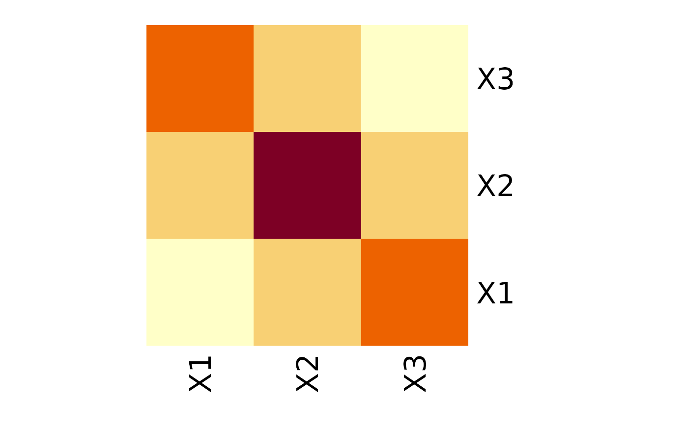
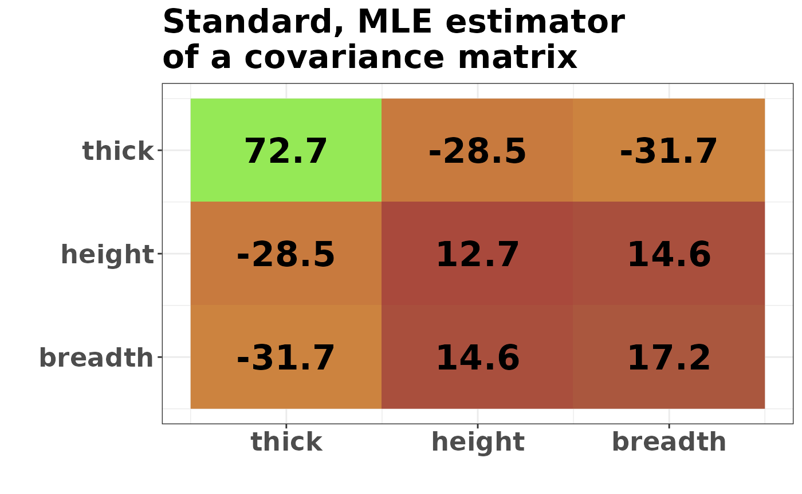
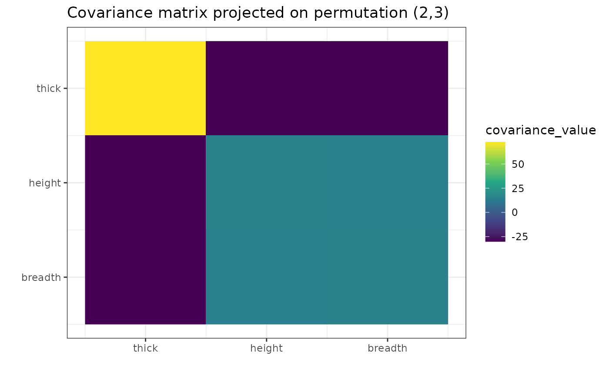
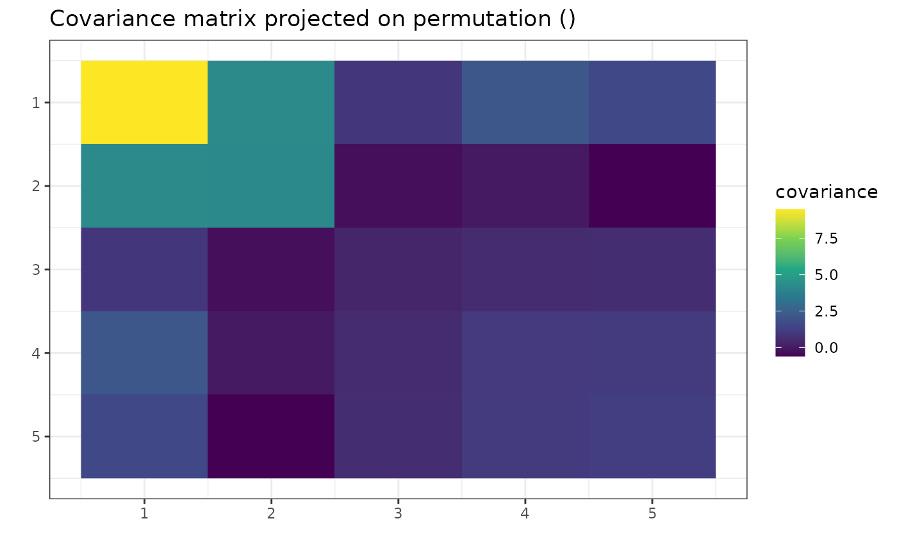
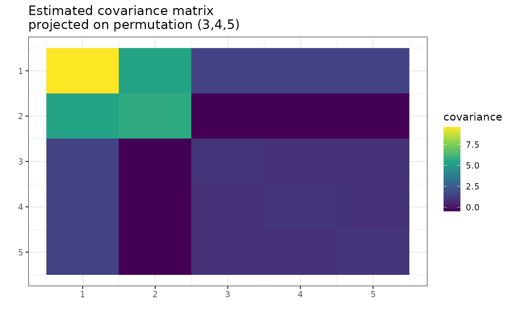

# A Gentle Introduction to Modeling with gips

## The problem

Quite often, we have too little data to perform valid inferences.
Consider the situation with multivariate Gaussian distribution, where we
have few observations compared to the number of variables. For example,
that’s the case for graphical models used in biology or medicine. In
such a setting, the usual way of finding the covariance matrix (the
maximum likelihood method) isn’t statistically applicable. What now?

## Invariance by permutation

Sometimes, the interchange of variables in the vector does not change
its distribution. In the multivariate Gaussian case, it would mean that
they have the same variances and covariances with other respective
variables. For instance, in the following covariance matrix, variables
X1 and X3 are interchangeable, meaning that vectors (X1, X2, X3) and
(X3, X2, X1) have the same distribution.



Now, we can state this interchangeability property in terms of
permutations. In our case, the distribution of (X1, X2, X3) is
**invariant by permutation** ($`1\mapsto3`$, $`3\mapsto1`$), or in
cyclic form $`(1,3)(2)`$. This is equivalent to saying that swapping the
first with the third row and then swapping the first and third columns
of the covariance matrix results in the same matrix. Then we say that
this covariance matrix is **invariant by permutation**.

Of course, in the samples collected in the real world, no perfect
equalities will be observed. Still, if the respective values in the
(poorly) estimated covariance matrix were close, adopting a particular
assumption about invariance by permutation would be a reasonable step.

## Package `gips`

We propose creating a set of constraints on the covariance matrix to use
the maximum likelihood method. The constraint we consider is - none
other than - invariance under permutation symmetry.

This package provides a way to find a *reasonable* permutation to be
used as a constraint in covariance matrix estimation. In this case,
*reasonable* means maximizing the Bayesian posterior distribution when
using a Wishart-like distribution on symmetric, positive definite
matrices as a prior. The idea, exact formulas, and algorithm sketch are
explored in another vignette that can be accessed by
[`vignette("Theory", package="gips")`](https://przechoj.github.io/gips/articles/Theory.md)
or on its [pkgdown
page](https://przechoj.github.io/gips/articles/Theory.html).

For an in-depth analysis of the package performance, capabilities, and
comparison with other packages, see the article “Learning permutation
symmetries with gips in R” by `gips`’ developers Adam Chojecki, Paweł
Morgen, and Bartosz Kołodziejek, [Journal of Statistical
Software](doi:10.18637/jss.v112.i07).

## Practical example

Let’s examine 12 books’ thick, height, and breadth data:

``` r

library(gips)

Z <- DAAG::oddbooks[, c(1, 2, 3)]
```

We suspect books from this dataset were printed with $`\sqrt{2}`$ aspect
ratio as in popular [A-series paper
size](https://en.wikipedia.org/wiki/Paper_size#A_series). Therefore, we
can use this expert knowledge in the analysis and unify the data for
height and width:

``` r

Z$height <- Z$height / sqrt(2)
```

Now, let’s plot the data:

``` r

number_of_observations <- nrow(Z) # 12
p <- ncol(Z) # 3

S <- cov(Z)
round(S, 1)
#>         thick height breadth
#> thick    72.7  -28.5   -31.7
#> height  -28.5   12.7    14.6
#> breadth -31.7   14.6    17.2
g <- gips(S, number_of_observations)
plot_cosmetic_modifications(plot(g, type = "heatmap")) +
  ggplot2::ggtitle("Standard, MLE estimator\nof a covariance matrix")
```



We can see similarities between columns 2 and 3, representing the book’s
height and breadth. In particular, the covariance between \[1,2\] is
very similar to \[1,3\], and the variance of \[2\] is similar to the
variance of \[3\]. Those are not surprising, given the data
interpretation (after the rescaling of height that we did).

Let’s see what the `gips` will tell about this data:

``` r

g_map <- find_MAP(g,
  optimizer = "brute_force",
  return_probabilities = TRUE, save_all_perms = TRUE
)
#> ================================================================================
#> ================================================================================
#> ================================================================================

g_map
#> The permutation (2,3):
#>  - was found after 5 posteriori calculations;
#>  - is 1.305 times more likely than the () permutation.
get_probabilities_from_gips(g_map)
#>          (2,3)             ()          (1,3)        (1,2,3)          (1,2) 
#> 0.566078057717 0.433908667868 0.000006728772 0.000004683290 0.000001862353
```

`find_MAP` found the symmetry represented by permutation (2,3).

``` r

plot_cosmetic_modifications(plot(g_map, type = "heatmap"))
```



``` r

round(project_matrix(S, g_map), 1)
#>         thick height breadth
#> thick    72.7  -30.1   -30.1
#> height  -30.1   14.9    14.6
#> breadth -30.1   14.6    14.9
```

The result depends on two input parameters, `delta` and `D_matrix`. By
default, they are set to `3` and `diag(p) * d`, respectively, where
`d = mean(diag(S))`. The method is not scale-invariant, so we recommend
running gips for different values of `D_matrix` of the form
`D_matrix = d * diag(p)`, where `d` $`\in \mathbb{R}^+`$). The impact
analysis of those can be read in \[2\] in section *3.2. Hyperparameter’s
influence*.

## Theoretic example

``` r

p <- 5
number_of_observations <- 4
mu <- runif(p, -10, 10) # Assume we don't know the mean
sigma_matrix <- matrix(c(
  8.4, 4.1, 1.9, 1.9, 1.9,
  4.1, 3.5, 0.3, 0.3, 0.3,
  1.9, 0.3, 1,   0.8, 0.8,
  1.9, 0.3, 0.8, 1,   0.8,
  1.9, 0.3, 0.8, 0.8, 1
), ncol = p)
# sigma_matrix is a matrix invariant under permutation (3,4,5)
toy_example_data <- withr::with_seed(2022,
  code = MASS::mvrnorm(number_of_observations,
    mu = mu, Sigma = sigma_matrix
  )
)
```

Show/hide data preparation

``` r

library(gips)

toy_example_data
#>            [,1]     [,2]     [,3]      [,4]       [,5]
#> [1,]  -5.554883 7.466693 2.444659 -5.757642  -9.374783
#> [2,] -11.330708 1.700968 2.756588 -5.623130  -8.560550
#> [3,] -10.579451 3.914784 2.327188 -7.085606 -10.115170
#> [4,] -12.634411 4.881232 1.248641 -8.067525 -11.114509

dim(toy_example_data)
#> [1] 4 5
number_of_observations <- nrow(toy_example_data) # 4
p <- ncol(toy_example_data) # 5

S <- cov(toy_example_data)

sum(eigen(S)$values > 0.00000001)
#> [1] 3
```

Note that the rank of the `S` matrix is 3, despite the
`number_of_observations` being 4. This is because
[`cov()`](https://rdrr.io/r/stats/cor.html) estimated the mean on every
column to compute `S`.

We want to find reasonable additional assumptions on `S` to make it
easier to estimate.

``` r

g <- gips(S, number_of_observations)

plot(g, type = "heatmap")
```



Looking at the plot, one can see the similarities between columns 3, 4,
and 5. They have similar variance and covariance to each other. The 3
and 5 have similar covariance with columns 1 and 2. However, the 4 is
also close.

Let’s see if `gips` will find the relationship:

``` r

g_map <- find_MAP(g,
  optimizer = "brute_force",
  return_probabilities = TRUE, save_all_perms = TRUE
)
#> ================================================================================
#> ================================================================================
#> ================================================================================

plot(g_map, type = "heatmap")
```



`gips` decided that $`(3,4,5)`$ was the most reasonable assumption.
Let’s see how much better it is:

``` r

g_map
#> The permutation (3,4,5):
#>  - was found after 67 posteriori calculations;
#>  - is 3.63 times more likely than the () permutation.
```

This assumption is over 3 times more believable than making no
assumption. Let’s examine how reasonable are other possible assumptions:

``` r

get_probabilities_from_gips(g_map)
#>      (3,4,5)      (2,4,5) (1,2)(3,4,5)    (2,3,5,4)        (4,5)        (3,5) 
#>  0.061991931  0.056959514  0.048479131  0.040410788  0.038027185  0.037829891 
#>        (3,4)    (2,3,4,5)    (2,4,3,5)   (2,4)(3,5)      (2,3,5)   (1,2)(3,5) 
#>  0.035085538  0.034415530  0.033895061  0.031448291  0.029438098  0.026938644 
#>   (1,2)(3,4)   (2,5)(3,4)   (1,2)(4,5)      (2,3,4)        (2,5)        (2,4) 
#>  0.026167559  0.025906388  0.025384163  0.024145834  0.024081717  0.020399181 
#> (1,2,4)(3,5)    (1,4,2,5)   (2,3)(4,5)           ()  (1,2,3,5,4)    (1,2,5,4) 
#>  0.019323499  0.018904417  0.018141398  0.017079855  0.016588093  0.016298998 
#> (1,2,5)(3,4)    (1,2,4,5)        (1,2) (1,4)(2,3,5)        (2,3)  (1,2,3,4,5) 
#>  0.015996810  0.013635218  0.013223117  0.012292494  0.011350938  0.010572077 
#>  (1,2,5,3,4) (1,2,3)(4,5)  (1,2,4,5,3)   (1,4)(2,5) (1,3)(2,4,5)  (1,2,4,3,5) 
#>  0.010280022  0.010147160  0.009968266  0.009810562  0.009448103  0.009398996 
#>    (1,2,3,5)      (1,2,4)      (1,2,5) (1,5)(2,3,4)    (1,3,2,5)    (1,2,3,4) 
#>  0.009168309  0.009011297  0.008941143  0.008833158  0.008315048  0.008279742 
#>  (1,2,5,4,3)    (1,3,2,4)   (1,4)(3,5)   (1,5)(2,4)    (1,2,5,3)      (1,2,3) 
#>  0.008007561  0.006254947  0.005565898  0.005389584  0.004968273  0.004515910 
#>   (1,4)(2,3)   (1,5)(2,3)    (1,2,4,3)   (1,3)(4,5)   (1,5)(3,4) (1,3,4)(2,5) 
#>  0.004287814  0.004249572  0.003919107  0.003875914  0.003868923  0.003383014 
#>        (1,4)   (1,3)(2,5)        (1,5) (1,3,5)(2,4)        (1,3)      (1,4,5) 
#>  0.003272443  0.002762345  0.002701743  0.002404967  0.002143353  0.002045112 
#> (1,4,5)(2,3)      (1,3,4)   (1,3)(2,4)      (1,3,5)    (1,3,5,4)    (1,4,3,5) 
#>  0.001893502  0.001828460  0.001732156  0.001582799  0.001166460  0.001118505 
#>    (1,3,4,5) 
#>  0.001048474
```

We see that assumption $`(3,4,5)`$ is the most likely with a $`6.2\%`$
posterior probability. 21 possible permutations are more likely than id.

Remember that the `n0` could still be too big for your data. In this
example, the assumptions with transpositions (like $`(3,5)`$) would
yield the `n0` $`= 5`$, which would be insufficient for us to estimate
covariance correctly. The assumption $`(3,4,5)`$ will be just right:

``` r

summary(g_map)$n0 # n0 = 4 <= 4 = number_of_observations
#> [1] 4

S_projected <- project_matrix(S, g_map)
S_projected
#>          [,1]       [,2]       [,3]       [,4]       [,5]
#> [1,] 9.601087  5.4152903  1.4727442  1.4727442  1.4727442
#> [2,] 5.415290  5.7077767 -0.4783693 -0.4783693 -0.4783693
#> [3,] 1.472744 -0.4783693  0.9870649  0.8600285  0.8600285
#> [4,] 1.472744 -0.4783693  0.8600285  0.9870649  0.8600285
#> [5,] 1.472744 -0.4783693  0.8600285  0.8600285  0.9870649
sum(eigen(S_projected)$values > 0.00000001)
#> [1] 5
```

Now, the estimated covariance matrix is of full rank (5).

## Further reading

1.  To learn more about the available optimizers in
    [`find_MAP()`](https://przechoj.github.io/gips/reference/find_MAP.md)
    and how to use those, see
    [`vignette("Optimizers", package="gips")`](https://przechoj.github.io/gips/articles/Optimizers.md)
    or its [pkgdown
    page](https://przechoj.github.io/gips/articles/Optimizers.html).
2.  To learn more about the math and theory behind the `gips` package,
    see
    [`vignette("Theory", package="gips")`](https://przechoj.github.io/gips/articles/Theory.md)
    or its [pkgdown
    page](https://przechoj.github.io/gips/articles/Theory.html).
3.  For an in-depth analysis of the package performance, capabilities,
    and comparison with other packages, see the article “Learning
    permutation symmetries with gips in R” by `gips` developers Adam
    Chojecki, Paweł Morgen, and Bartosz Kołodziejek, [Journal of
    Statistical Software](doi:10.18637/jss.v112.i07).
