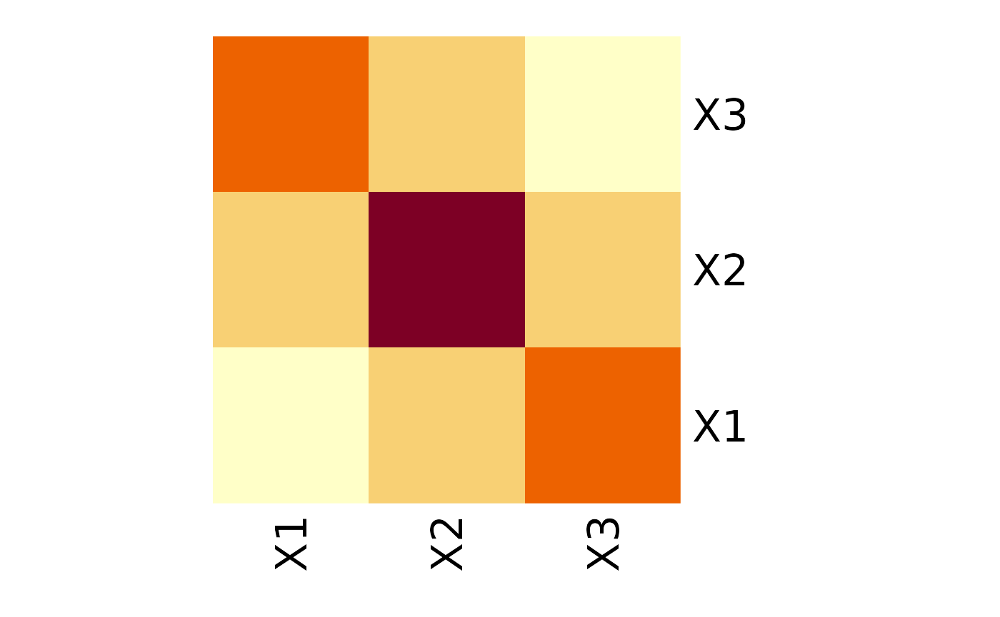
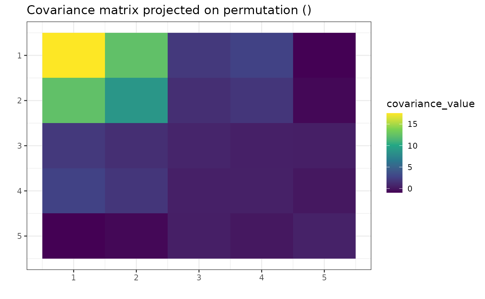
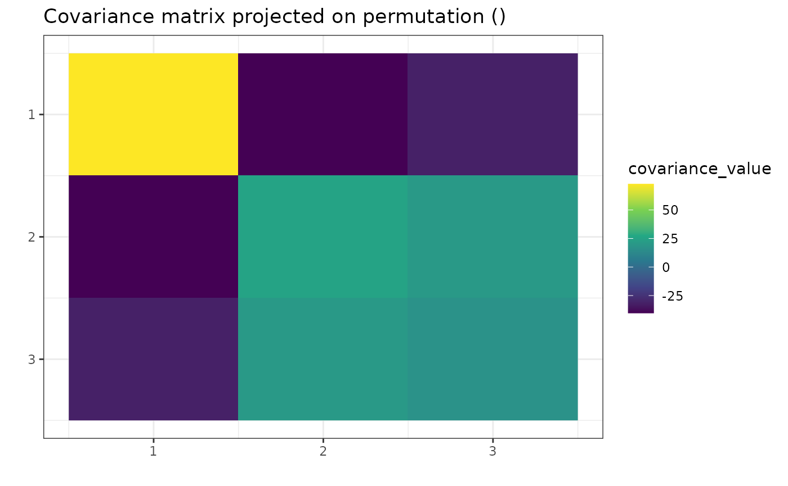

# gips

## The problem

Quite often, we have too little data to perform valid inference.
Consider the situation with multivariate Gaussian distribution, where we
have few observations compared to the number of variables. For example,
that’s the case for graphical models used in biology or medicine. In
such a setting, the usual way of finding the covariance matrix (the
maximum likelihood method) isn’t statistically applicable. What now?

## Invariance by permutation

In some cases, the interchange of variables in the vector does not
change its distribution. In the multivariate Gaussian case, it would
mean that they have the same variances and covariances with other
respective variables. For instance, in the following covariance matrix,
variables X1 and X3 are interchangeable, meaning that vectors (X1, X2,
X3) and (X3, X2, X1) have the same distribution.



Now, we can state this interchangeability property in terms of
permutations. In our case, the distribution of (X1, X2, X3) is
**invariant by permutation** ($`1\mapsto3`$, $`3\mapsto1`$), or in
cyclic form $`(1,3)(2)`$. This is equivalent to saying that swapping the
first with the third row and then swapping the first and third columns
of the covariance matrix results in the same matrix. Then we say that
this covariance matrix is **invariant by permutation**.

Of course, in the samples collected in the real world, no perfect
equalities will be observed. Still, if the respective values in the
(poorly) estimated covariance matrix were close, adopting a particular
assumption about invariance by permutation would be a reasonable step.

## Package `gips`

We propose creating a set of constraints on the covariance matrix to use
the maximum likelihood method. The constraint we consider is - none
other than - invariance under permutation symmetry.

This package provides a way to find a *reasonable* permutation to be
used as a constraint in covariance matrix estimation. In this case,
*reasonable* means maximizing the Bayesian posterior distribution when
using a Wishart-like distribution on symmetric, positive definite
matrices as a prior. The idea, exact formulas, and algorithm sketch are
explored in another vignette that can be accessed by
[`vignette("Theory")`](https://przechoj.github.io/gips/articles/Theory.md)
or on its [pkgdown
page](https://przechoj.github.io/gips/articles/Theory.html).

## Example

``` r

perm_size <- 5
mu <- runif(5, -10, 10) # Assume we don't know the mean
sigma_matrix <- matrix(c(7.5, 5,   0.5, 0.5, 0.5,
                         5,   4.5, 0.3, 0.3, 0.3,
                         0.5, 0.3, 1,   0.8, 0.8,
                         0.5, 0.3, 0.8, 1,   0.8,
                         0.5, 0.3, 0.8, 0.8, 1), ncol=5)
# sigma_matrix is a matrix invariant under permutation (3,4,5)
number_of_observations <- 4
toy_example_data <- withr::with_seed(1234,
    code = MASS::mvrnorm(number_of_observations,
                         mu = mu, Sigma = sigma_matrix)
)
```

Show/hide data preparation

``` r

library(gips)

toy_example_data
#>            [,1]     [,2]     [,3]      [,4]       [,5]
#> [1,] -11.886380 4.753934 1.092400 -7.191882 -10.511253
#> [2,]  -8.064560 7.955955 1.669257 -6.948952 -10.521423
#> [3,]  -5.776251 9.079530 3.139842 -5.992006  -9.517660
#> [4,] -15.261303 2.611751 1.976991 -7.597607  -9.065878

dim(toy_example_data)
#> [1] 4 5
number_of_observations <- nrow(toy_example_data) # 4
perm_size <- ncol(toy_example_data) # 5

S <- cov(toy_example_data)

sum(eigen(S)$values > 0.00000001)
#> [1] 3
```

Note that the rank of the `S` matrix is 3, despite the
`number_of_observations` being 4. This is because
[`cov()`](https://rdrr.io/r/stats/cor.html) estimated the mean on every
column to compute `S`.

We want to find reasonable additional assumptions on `S` to make it
easier to estimate.

``` r

g <- gips(S = S, number_of_observations = nrow(toy_example_data))

plot(g, type = "heatmap")
```



Looking at the plot, one can see the similarities between columns 3, 4,
and 5. They have similar variance and covariance to each other. The 3
and 5 have similar covariance with columns 1 and 2. However, the 4 is
not far from them.

Let’s see if `gips` will find the relationship:

``` r

g_map <- find_MAP(g, optimizer = "brute_force",
                  return_probabilities = TRUE, save_all_perms = TRUE)
#> ================================================================================
#> ================================================================================
#> Warning: The found permutation has n0 = 5 which is bigger than the number_of_observations = 4.
#> ℹ The covariance matrix invariant under the found permutation does not have the likelihood properly defined.
#> ℹ For more in-depth explanation, see 'Project Matrix - Equation (6)' section in `vignette('Theory', package = 'gips')` or its pkgdown page: https://przechoj.github.io/gips/articles/Theory.html.

plot(g_map, type = "heatmap")
```


`gips` decided that $`(3,4,5)`$ was the most reasonable assumption.
Let’s see how much better it is:

``` r

g_map
#> The permutation (3,4)
#>  - was found after 120 log_posteriori calculations
#>  - is 3.79207316417081 times more likely than the starting, () permutation.
```

This assumption is over two times more believable than making no
assumption. Let’s examine how reasonable are other possible assumptions:

``` r

get_probabilities_from_gips(g_map)
#>             ()          (4,5)          (3,4)        (3,4,5)          (3,5) 
#> 0.069068384307 0.060727414839 0.261912366623 0.197438701138 0.086934032936 
#>          (2,3)     (2,3)(4,5)        (2,3,4)      (2,3,4,5)      (2,3,5,4) 
#> 0.002520241430 0.006495999997 0.001182043961 0.000080031096 0.000234494736 
#>        (2,3,5)          (2,4)        (2,4,5)     (2,4)(3,5)      (2,4,3,5) 
#> 0.000410499786 0.002137051762 0.000410407100 0.004843578288 0.000065540223 
#>          (2,5)     (2,5)(3,4)          (1,2)     (1,2)(4,5)     (1,2)(3,4) 
#> 0.001009443542 0.001421639262 0.019092314439 0.033265194830 0.055875021388 
#>   (1,2)(3,4,5)     (1,2)(3,5)        (1,2,3)   (1,2,3)(4,5)      (1,2,3,4) 
#> 0.071376121642 0.057369194387 0.000213901332 0.000256492936 0.000100763693 
#>    (1,2,3,4,5)    (1,2,3,5,4)      (1,2,3,5)      (1,2,4,3)    (1,2,4,5,3) 
#> 0.000005822908 0.000327661509 0.000176796343 0.000052885180 0.000211582316 
#>        (1,2,4)      (1,2,4,5)   (1,2,4)(3,5)    (1,2,4,3,5)    (1,2,5,4,3) 
#> 0.000091830785 0.000011635176 0.000143967951 0.000009848927 0.000009992229 
#>      (1,2,5,3)      (1,2,5,4)        (1,2,5)    (1,2,5,3,4)   (1,2,5)(3,4) 
#> 0.003827744236 0.000300980514 0.000113543776 0.000025464602 0.000506120822 
#>          (1,3)     (1,3)(4,5)        (1,3,4)      (1,3,4,5)      (1,3,5,4) 
#> 0.000622993877 0.001543477661 0.000058544101 0.000002108636 0.000004421858 
#>        (1,3,5)     (1,3)(2,4)   (1,3)(2,4,5)      (1,3,2,4)   (1,3,5)(2,4) 
#> 0.000101638418 0.000995784985 0.000032602399 0.000478312732 0.000004978116 
#>     (1,3)(2,5)      (1,3,2,5)   (1,3,4)(2,5)          (1,4)        (1,4,5) 
#> 0.026206794910 0.005021800273 0.000010645580 0.000206209778 0.000047628153 
#>     (1,4)(3,5)      (1,4,3,5)     (1,4)(2,3)   (1,4,5)(2,3)   (1,4)(2,3,5) 
#> 0.000409718620 0.000001927521 0.000365234206 0.000017712903 0.000002866249 
#>     (1,4)(2,5)      (1,4,2,5)          (1,5)     (1,5)(3,4)     (1,5)(2,3) 
#> 0.000501465259 0.000237282418 0.000629620291 0.000683780081 0.020299482408 
#>   (1,5)(2,3,4)     (1,5)(2,4) 
#> 0.000081562806 0.001174652814
```

We see that assumption $`(3,4,5)`$ is the most likely with $`19.9\%`$
posterior probability. However, the assumption $`(3,5)`$ is also
reasonable, with a posterior probability of $`19.6\%`$. So it is up to
us to decide which one to choose.

Remember that with the assumption $`(3,5)`$, the `n0` will be 4, which
would be insufficient for us to estimate covariance correctly. The
assumption $`(3,4,5)`$ will be just right:

``` r

S_projected <- project_matrix(S, g_map[[1]])
sum(eigen(S_projected)$values > 0.00000001)
#> [1] 4
```

Now, the estimated covariance matrix is of full rank (5).

## Practical example

Let’s examine 12 books’ thick, height, and breadth data:

``` r

library(gips)

Z <-DAAG::oddbooks[,c(1,2,3)]

number_of_observations <- nrow(Z) # 12
p <- ncol(Z) # 3

S <- cov(Z)
S
#>             thick    height   breadth
#> thick    72.69697 -40.33485 -31.74242
#> height  -40.33485  25.36992  20.58576
#> breadth -31.74242  20.58576  17.18424
g <- gips(S, number_of_observations, D_matrix=diag(p)) # the default D_matrix
plot(g, type = "heatmap")
```



We can see similarities between columns 2 and 3, representing the book’s
height and breadth. In particular, the covariance between \[1,2\] is
very similar to \[1,3\], and the variance if \[2\] is similar to the
variance of \[3\]. Those are not surprising, given the interpretation of
the data.

``` r

g_map <- find_MAP(g, optimizer = "brute_force",
                  return_probabilities = TRUE, save_all_perms = TRUE)
#> ================================================================================
#> ================================================================================

g_map
#> The permutation ()
#>  - was found after 6 log_posteriori calculations
#>  - is 1 times more likely than the starting, () permutation.
get_probabilities_from_gips(g_map)
#>                   ()                (2,3)                (1,2) 
#> 0.917699644399123216 0.082300333638115772 0.000000000064309861 
#>              (1,2,3)                (1,3) 
#> 0.000000021892918704 0.000000000005532453
```

We see the search was too restrictive and did not find the permutation.
We will weaken the restrictions by changing the `D_matrix` parameter.

``` r

g <- gips(S, number_of_observations, D_matrix=0.05*diag(p))
g_map <- find_MAP(g, optimizer = "brute_force",
                  return_probabilities = TRUE, save_all_perms = TRUE)
#> ================================================================================
#> ================================================================================

g_map
#> The permutation (2,3)
#>  - was found after 6 log_posteriori calculations
#>  - is 3.5796631131816 times more likely than the starting, () permutation.
get_probabilities_from_gips(g_map)
#>                  ()               (2,3)               (1,2)             (1,2,3) 
#> 0.21834865211409399 0.78161461578574387 0.00000000027813589 0.00003673179839076 
#>               (1,3) 
#> 0.00000000002363545
```

`find_MAP` found the symmetry represented by permutation (2,3). The
result depends on two input parameters, `delta` and `D_matrix`. By
default they are set to `3` and `diag(p)`, respectively.

The method is not scale-invariant and therefore we recommend to run gips
for different values of `D_matrix` (typically, of the form
`C * diag(p)`).

## Further reading

1.  To learn more about the available optimizers in
    [`find_MAP()`](https://przechoj.github.io/gips/reference/find_MAP.md)
    and how to use those, see
    [`vignette("Optimizers")`](https://przechoj.github.io/gips/articles/Optimizers.md)
    or its [pkgdown
    page](https://przechoj.github.io/gips/articles/Optimizers.html).
2.  To learn more about the math and theory behind the `gips` package,
    see
    [`vignette("Theory")`](https://przechoj.github.io/gips/articles/Theory.md)
    or its [pkgdown
    page](https://przechoj.github.io/gips/articles/Theory.html).
